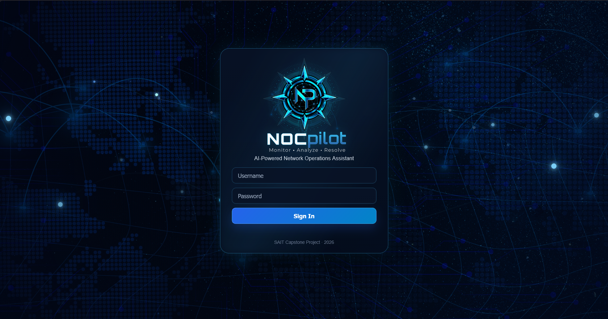
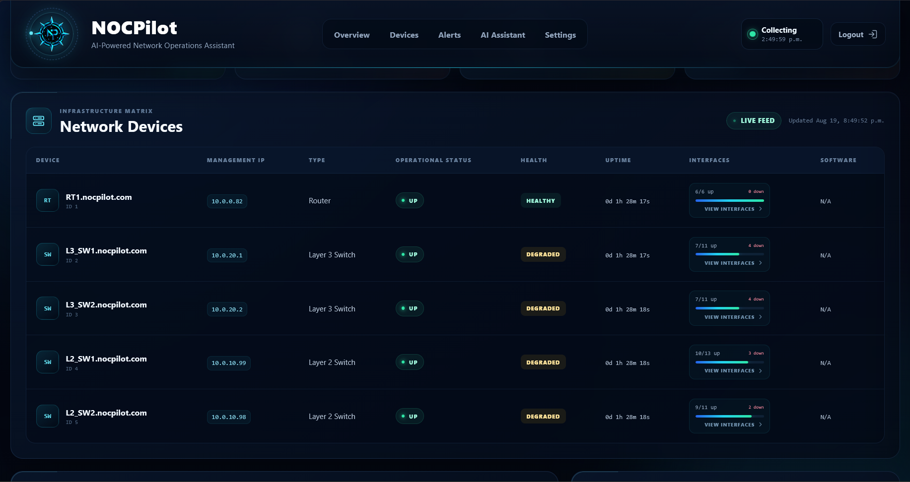
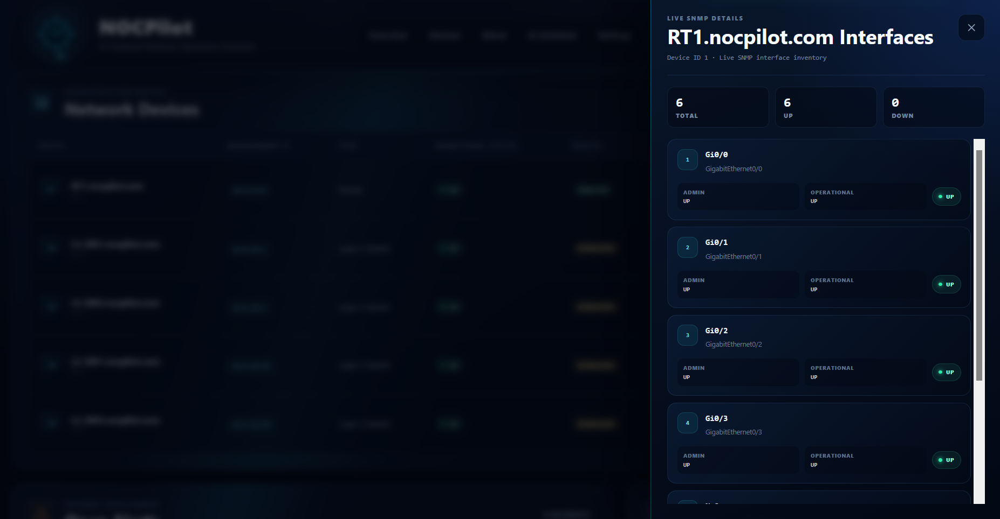
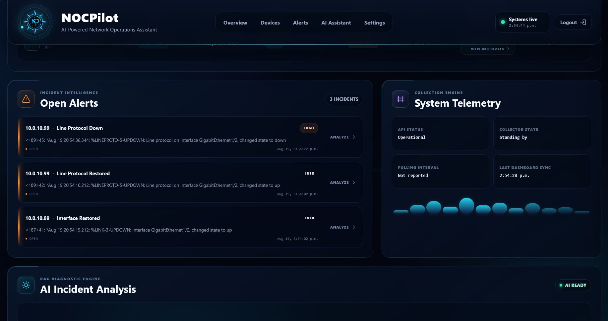
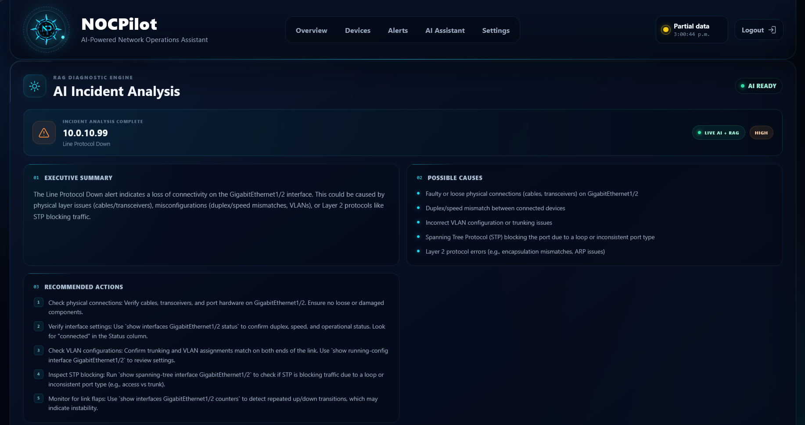
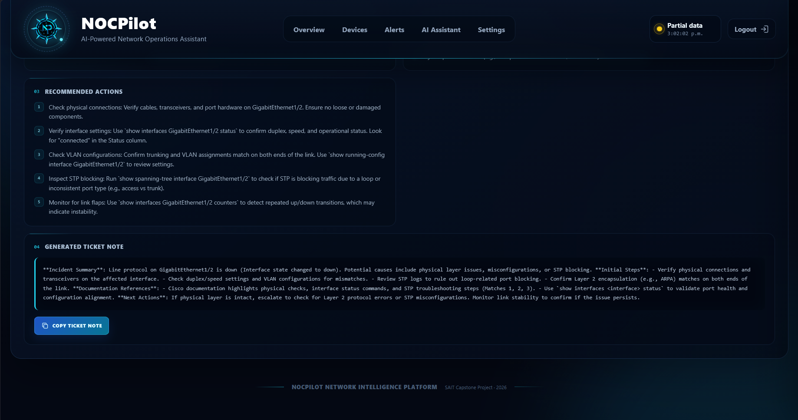

# NOCPilot — Network Monitoring Dashboard with AI-Assisted Troubleshooting

NOCPilot is a SAIT capstone project that demonstrates a modern Network Operations Center (NOC) dashboard. The application monitors network devices using SNMP, displays live device status and alerts, and incorporates a Retrieval-Augmented Generation (RAG) pipeline to provide AI-assisted troubleshooting, recommended resolutions, and incident ticket notes.

Developed as a proof of concept, NOCPilot demonstrates how traditional network monitoring can be enhanced with AI to improve situational awareness and streamline incident response while keeping network telemetry and alerting at the core of the platform.


## Project Team

| Team Member | Primary Responsibilities |
|-------------|--------------------------|
| Amir Kosari | SNMP integration, network architecture |
| Jenard Marin | Network architecture, EVE-NG simulation |
| Sadek El Kaderi | Frontend development, frontend/backend integration |
| Jordan Ellerby | AI integration, Retrieval-Augmented Generation (RAG) design |
| Louie Estranero | Graphic design, UI/UX design |


## Project Goal

Help Tier 1 NOC analysts understand network alerts faster and reduce troubleshooting time.


## Features

- Live alerts
- Device dashboard
- Alert dashboard
- AI troubleshooting explanation
- AI ticket note generation
- EveNG lab running cisco device images


## Tech Stack

### Backend
- Python 3.13
- FastAPI
- Pydantic

### Frontend
- React
- JavaScript

### Network Monitoring
- SNMP
- PySNMP

### AI & Knowledge Retrieval
- OpenAI-compatible API
- LangChain
- ChromaDB
- Sentence Transformers
- PyMuPDF

### Development Tools
- uv
- Git & GitHub
- Visual Studio Code


## How to Run

### Create the Python environment and install dependencies

   ```bash
   uv sync
   source .venv/bin/activate      # Linux/macOS
   .venv\Scripts\Activate.ps1     # Windows PowerShell
   ```

   Creates a virtual environment, activates it, and installs all required project dependencies.

### Initialize the knowledge base

   From the backend directory

   ```bash
   uv run ingest.py
   ```

   Indexes the included troubleshooting PDF documents into ChromaDB. This step only needs to be repeated when the knowledge base documents are added or updated.


### Start the Backend

```bash
uv run uvicorn backend.main:app --host 0.0.0.0 --port 8000
```

### Connect to Dashboard

http://(machine ip address):8000


## Configuration

### AI Endpoint

NOCPilot connects to an OpenAI-compatible inference endpoint for AI-assisted troubleshooting. During development, the project was tested using LM Studio hosting the Qwen3-8B model locally, but any compatible endpoint may be used.

Configure the endpoint address and port through the dashboard settings, or by editing `config.json` directly.

> **Development Note:** The ChromaDB chunk size, system prompt, and query formatting were tuned for Qwen3-8B running on a single RTX 3080 GPU. Extensive testing has not been performed with other models, and output quality may vary depending on the selected model and available hardware.

### Knowledge Base

Troubleshooting documentation is stored in `backend/docs/`. The `ingest.py` script calculates file hashes to detect changes and only rebuilds chunks for documents that have been modified.

If the chunk size or overlap settings in `ingest.py` are changed, the existing ChromaDB database must be deleted and rebuilt because the ingestion process does not currently track these configuration changes.

After adding, removing, or modifying PDF documents, run:

```bash
uv run backend/ingest.py
```


## Repository Structure

### backend/

| File / Directory | Description |
|------------------|-------------|
| `docs/` | Troubleshooting knowledge base documents, organized by vendor. |
| `ingest.py` | Indexes the troubleshooting documents into the ChromaDB vector database for use by the RAG pipeline. |
| `llm_contact.py` | Sends prompts and retrieved context to a configurable OpenAI-compatible inference endpoint and returns the generated response. |
| `retrieval.py` | Retrieves the most relevant document chunks from the ChromaDB knowledge base. |
| `llmtest.py` | Standalone utility for testing the RAG pipeline outside of the dashboard. |
| `query.py` | Development utility used during implementation and troubleshooting of the RAG system. |


## Demo Flow

### 1. Open dashboard



Open the dashboard on your browser of choice by navigating to `http://127.0.0.1:8000`

| Username | Password |
|----------|----------|
| `admin` | `nocpilot123` |

> Note: If you are accessing the dashboard externally, replace the IP with the IP address of the system that is hosting NOCPilot.      
> `e.g. http://192.168.0.1:8000`

### 2. Show all devices healthy



NOCPilot uses SNMPv2 to gather system information such as Interface Status, Hardware Performance Metrics, Network Status, and more.
> Note: Devices shown as `Degraded` are due to SNMP detecting one or multiple Interfaces as down and/or unused.

<table>
  <tr>
    <td width="45%" valign="top">

### View Interface Details

Selecting `View Interfaces` under the Interface column opens a live SNMP interface inventory for the selected device.

The panel displays:
- Total interfaces
- Interfaces that are up/down
- Administrative status
- Operational status
- Real-time link state

    </td>

    <td width="55%" align="center">



  </tr>
</table>

### 3. Alert appears



In this scenario, we simulated an Interface flapping issue. Using Syslog, NOCPilot collects logs, events, and messages generated by network devices, allowing Administrators to monitor the network in real time.

Click on an `Alert` to analyze the event with the AI Assistant.

### 4. AI explanation



NOCPilot's `AI Assistant` analyzes Syslog events and provides contextual information and troubleshooting guidance. 

The AI will generate an `Executive Summary` that explains the incident, `Possible Causes` providing likely reasons for the incident, and `Recommended Actions` for suggested troubleshooting steps. 

### 5. Copy ticket note



Users can also copy a generated ticket note to document the incident in their IT Service Management platform of their choosing.


